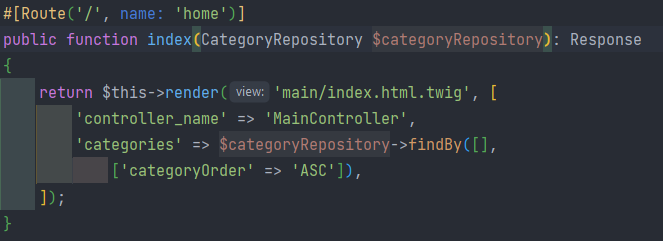
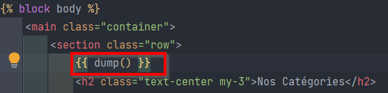
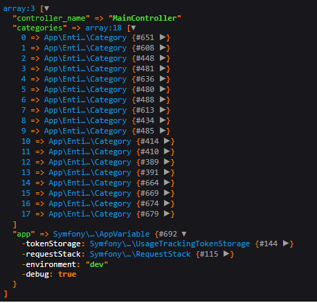
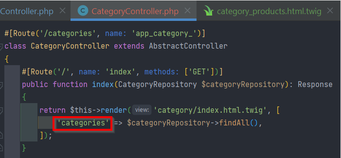

# Notes

## Dependence Webpack Encore

- Pour styliser l'application (CSS, JS, etc.) 
- ATTENTION ! "Whenever you make changes in your webpack.config.js file, you must stop and restart encore."

[Documentation et installation suivi dans le projet coincoin](https://symfony.com/doc/6.2/the-fast-track/fr/22-encore.html)  

[Autre source](https://symfony.com/doc/current/frontend.html)


[Using Webpack Encore with Symfony](https://symfony.com/doc/current/frontend/encore/simple-example.html)

## Utiliser Bootstrap5 pour les formulaires

[Documentation](https://symfony.com/doc/current/form/bootstrap5.html)

## Exemple pour concaténer le path d'un fichier dans le projet avec le nom du fichier en base de données

```twig
{{ asset('build/' ~ 'app.js') }}
``` 

Exemple : afficher l'image dans le template
```twig

```

## Pour générer des fixtures (données de test) en utilisant un faker

[Documentation](https://symfony.com/doc/current/bundles/DoctrineFixturesBundle/index.html)

### 1 - Installer les dépendances orm-fixtures et fakerphp/faker dans l'environnement de développement seulement
```
composer require --dev orm-fixtures fakerphp/faker
```

### 2 - Taper la commande pour générer le fichier :

```
symfony console make:fixtures
```

Puis dans la console, choisir le nom de la classe (exemple : ProductFixtures)

Compléter le fichier avec les données à générer.  
Ces données seront enregistrées dans la base de données.  
Elles peuvent être réelles ou fictives (via l'utilisation du faker)


### 3 - Dans la console taper la commande suivante pour générer les données de test

Pour jouer toutes les fixtures :
```
symfony console doctrine:fixtures:load
```

Pour jouer une seule fixture :

```
symfony console doctrine:fixtures:load --group=somethingFixtures
```

**ATTENTION ! CETTE COMMANDE EFFACE TOUTE LA BDD.**


## Données DB dans un template twig

Cette commande permet de voir toutes les données des variables disponibles au niveau d'un template twig particulier :

```twig
{{ dump() }}
```


Les variables se trouvent dans le controller :
- les variables du controller  



- le dump dans la vue 



- le résultat dans le navigateur



## 

## Débat nom d'entité au singulier ou au pluriel en BDD ?

### Mon avis

Il est plus logique de les mettre noms au **pluriel**, notamment pour les boucles :
- au pluriel :
```twig

```
- au singulier :
```twig

```

Sinon, il faut pouvoir les modifier dans le controller et ...s'en souvenir pour chaque entité...




