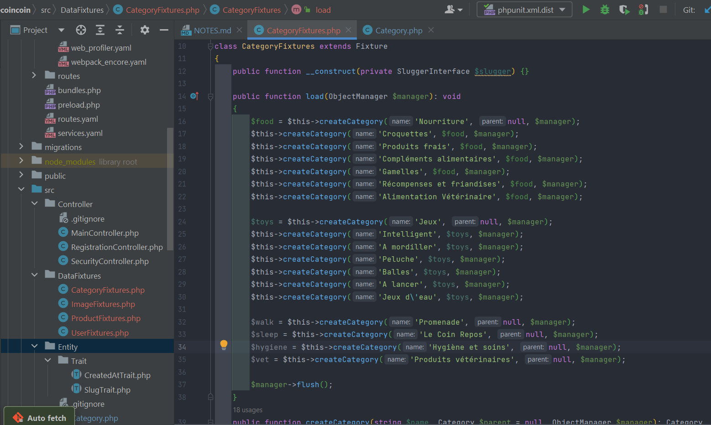
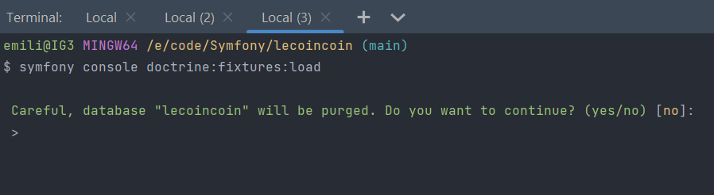

# Notes

## Dependence Webpack Encore

- Pour styliser l'application (CSS, JS, etc.) 
- ATTENTION ! "Whenever you make changes in your webpack.config.js file, you must stop and restart encore."

[Documentation et installation suivi dans le projet coincoin](https://symfony.com/doc/6.2/the-fast-track/fr/22-encore.html)  

[Autre source](https://symfony.com/doc/current/frontend.html)


[Using Webpack Encore with Symfony](https://symfony.com/doc/current/frontend/encore/simple-example.html)

## Utiliser Bootstrap5 pour les formulaires

[Documentation](https://symfony.com/doc/current/form/bootstrap5.html)

## Exemple pour concaténer le path d'un fichier dans le projet avec le nom du fichier en base de données

```twig
{{ asset('build/' ~ 'app.js') }}
``` 

Exemple : afficher l'image dans le template
```twig

```

## Pour générer des fixtures (données de test) en utilisant un faker

[Documentation](https://symfony.com/doc/current/bundles/DoctrineFixturesBundle/index.html)

### 1 - Installer les dépendances orm-fixtures et fakerphp/faker dans l'environnement de développement seulement
```
composer require --dev orm-fixtures fakerphp/faker
```

### 2 - Créer un nouveau fichier dans le dossier src/DataFixtures/ (ex: AppFixtures.php) et y ajouter les propriétés nécessaires à la création des données de test

```
symfony console make:fixtures
```



### 3 - Dans la console taper la commande suivante pour générer les données de test
```
symfony console doctrine:fixtures:load
```

ATTENTION ! Cette commande efface tout le contenu de la base.




